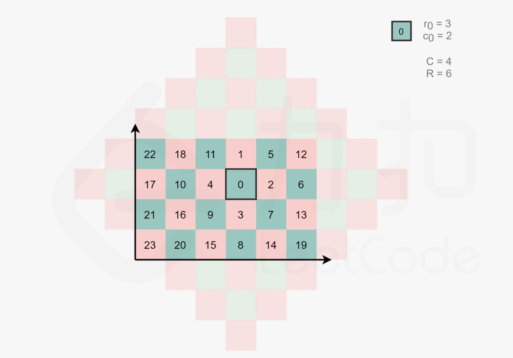

### 1030.距离顺序排列矩阵单元格

给出 `R` 行 `C` 列的矩阵，其中的单元格的整数坐标为 `(r, c)`，满足 `0 <= r < R` 且 `0 <= c < C`。

另外，我们在该矩阵中给出了一个坐标为 `(r0, c0)` 的单元格。

返回矩阵中的所有单元格的坐标，并按到 `(r0, c0)` 的距离从最小到最大的顺序排，其中，两单元格`(r1, c1)` 和 `(r2, c2)` 之间的距离是曼哈顿距离，`|r1 - r2| + |c1 - c2|`。（你可以按任何满足此条件的顺序返回答案。）

``` markdown
示例 1:
输入：R = 1, C = 2, r0 = 0, c0 = 0
输出：[[0,0],[0,1]]
解释：从 (r0, c0) 到其他单元格的距离为：[0,1]

示例2:
输入：R = 2, C = 2, r0 = 0, c0 = 1
输出：[[0,1],[0,0],[1,1],[1,0]]
解释：从 (r0, c0) 到其他单元格的距离为：[0,1,1,2]
[[0,1],[1,1],[0,0],[1,0]] 也会被视作正确答案。

示例3:
输入：R = 2, C = 3, r0 = 1, c0 = 2
输出：[[1,2],[0,2],[1,1],[0,1],[1,0],[0,0]]
解释：从 (r0, c0) 到其他单元格的距离为：[0,1,1,2,2,3]
其他满足题目要求的答案也会被视为正确，例如 [[1,2],[1,1],[0,2],[1,0],[0,1],[0,0]]。
```

**提示：**

1. `1 <= R <= 100`
2. `1 <= C <= 100`
3. `0 <= r0 < R`
4. `0 <= c0 < C`


思路1：直接排序

``` java
class Solution {
    public int[][] allCellsDistOrder(int R, int C, int r0, int c0) {
        int[][] matrix = new int[R * C][];
        for (int i = 0; i < R; i++) {
            for (int j = 0; j < C; j++) {
                matrix[i * C + j] = new int[]{i, j};
            }
        }
        Arrays.sort(matrix, new Comparator<int[]>() {
            public int compare(int[] a, int[] b) {
                return distance(a[0], a[1], r0, c0)
                    - distance(b[0], b[1], r0, c0);
            }
        });
        return matrix;
    }

    private int distance(int x1, int y1, int x0, int y0) {
        return Math.abs(x1 - x0) + Math.abs(y1 - y0);
    }
}

```

思路2：几何法(类似 BFS )



曼哈顿距离相同的位置恰好构成一个斜着的正方形边框，可以从小到大枚举曼哈顿距离

``` java
class Solution {
    int[] dr = {1, 1, -1, -1};
    int[] dc = {1, -1, -1, 1};

    public int[][] allCellsDistOrder(int R, int C, int r0, int c0) {
        int maxDist = Math.max(r0, R - 1 - r0) + Math.max(c0, C - 1 - c0);
        int[][] ret = new int[R * C][];
        int row = r0, col = c0;
        int index = 0;
        ret[index++] = new int[]{row, col};
        for (int dist = 1; dist <= maxDist; dist++) {
            row--;
            for (int i = 0; i < 4; i++) {
                while ((i % 2 == 0 && row != r0) || (i % 2 != 0 && col != c0)) {
                    if (row >= 0 && row < R && col >= 0 && col < C) {
                        ret[index++] = new int[]{row, col};
                    }
                    row += dr[i];
                    col += dc[i];
                }
            }
        }
        return ret;
    }
}
```

