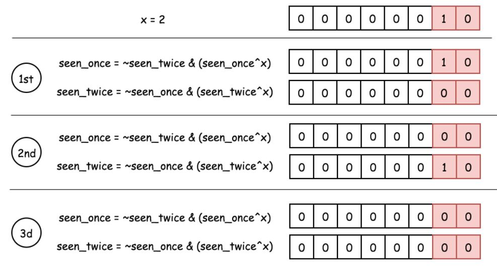

### 137.只出现一次的数字II

给定一个非空整数数组，除了某个元素只出现一次以外，其余每个元素均出现了三次。找出那个只出现了一次的元素。

说明：

你的算法应该具有线性时间复杂度。 你可以不使用额外空间来实现吗？

``` markdown
输入: [2,2,3,2]
输出: 3

输入: [0,1,0,1,0,1,99]
输出: 99
```


**思路1：** 哈希表

``` java
class Solution {
    public int singleNumber(int[] nums) {
        Map<Integer, Integer> map = new HashMap<>();
        for (int num : nums) {
            map.put(num, map.getOrDefault(num, 0) + 1);
        }
        for (Map.Entry<Integer, Integer> entry : map.entrySet()) {
            if (entry.getValue() == 1) {
                return entry.getKey();
            }
        }
        return -1;
    }
}
```


**思路2：** 位运算

通过位异或可以得到出现奇数次的整数，但这无法分辨 1 次和 3 次的整数，故引入两个位掩码，`seen_once` 和 `seen_twice`。

思路是：

- 仅当 `seen_twice` 未变时，改变 `seen_once`

- 仅当 `seen_once` 未变时，改变 `seen_twice`



出现一次时 `once = 1, twice = 0`， 出现三次时 `once = 0, twice = 0`，故最后返回 `seen_once` 即可。

``` java
class Solution {
    public int singleNumber(int[] nums) {
        int once = 0, twice = 0;
        for (int num : nums) {
            once = ~twice & (once ^ num);
            twice = ~once & (twice ^ num);
        }
        return once;
    }
}
```

