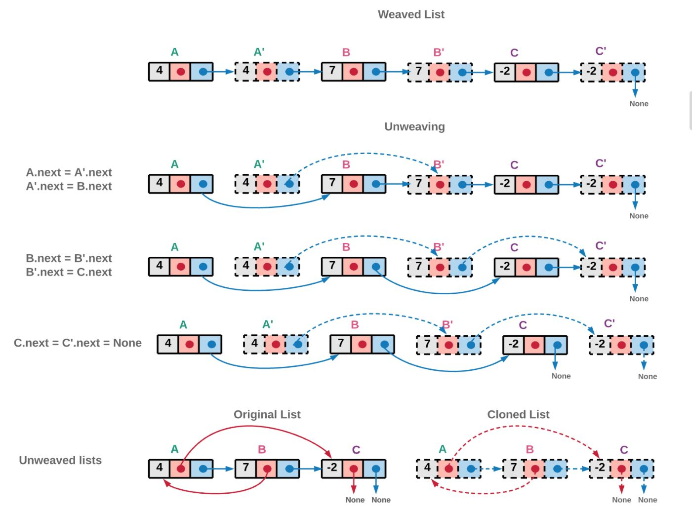

### 138.复制带随机指针的链表

给你一个长度为 `n` 的链表，每个节点包含一个额外增加的随机指针 `random` ，该指针可以指向链表中的任何节点或空节点。

构造这个链表的 深拷贝。 深拷贝应该正好由 `n` 个 全新 节点组成，其中每个新节点的值都设为其对应的原节点的值。新节点的 `next` 指针和 `random` 指针也都应指向复制链表中的新节点，并使原链表和复制链表中的这些指针能够表示相同的链表状态。复制链表中的指针都不应指向原链表中的节点 。

例如，如果原链表中有 X 和 Y 两个节点，其中 `X.random --> Y` 。那么在复制链表中对应的两个节点 x 和 y ，同样有 `x.random --> y` 。

返回复制链表的头节点。

你的代码 只 接受原链表的头节点 `head` 作为传入参数。

本题同 <a href="https://leetcode-cn.com/problems/fu-za-lian-biao-de-fu-zhi-lcof/">剑指Offer35</a>

**思路：** 复制+断链

将每个节点复制之后放到相应节点的 `next`，对于 `random` 也进行相应的复制（`new.random` = `old.random.next`，`old.random.next` 指向新节点 `random` 对应的节点），最后进行断链。



``` java
/*
// Definition for a Node.
class Node {
    int val;
    Node next;
    Node random;

    public Node(int val) {
        this.val = val;
        this.next = null;
        this.random = null;
    }
}
*/

class Solution {
    public Node copyRandomList(Node head) {
        if (head == null) {
            return null;
        }

        Node cur = head;
        while (cur != null) {
            Node node = new Node(cur.val, cur.next, null);
            cur.next = node;
            cur = node.next;
        }

        cur = head;
        while (cur != null) {
            cur.next.random = (cur.random != null) ? cur.random.next : null;
            cur = cur.next.next;
        }

        Node curOld = head;
        Node curNew = head.next;
        Node headNew = head.next;
        while (curOld != null) {
            Node nextOld = curOld.next.next;
            Node nextNew = (curNew.next != null)? curNew.next.next:null ;
            curOld.next = nextOld;
            curNew.next = nextNew;
            curOld = nextOld;
            curNew = nextNew; 
        }
        return headNew;
    }
}
```

