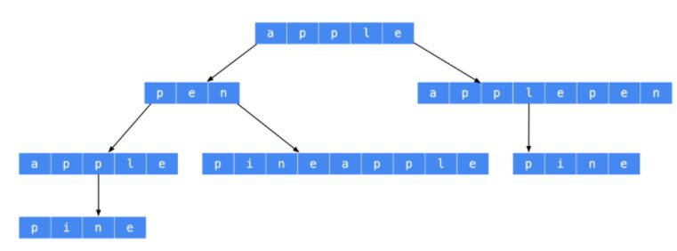

### 140. 单词拆分II

给定一个非空字符串 `s` 和一个包含非空单词列表的字典 `wordDict`，在字符串中增加空格来构建一个句子，使得句子中所有的单词都在词典中。返回所有这些可能的句子。

说明：

- 分隔时可以重复使用字典中的单词。

- 你可以假设字典中没有重复的单词。

``` markdown
示例1:
输入:
s = "catsanddog"
wordDict = ["cat", "cats", "and", "sand", "dog"]
输出:
[
  "cats and dog",
  "cat sand dog"
]

示例2:
输入:
s = "pineapplepenapple"
wordDict = ["apple", "pen", "applepen", "pine", "pineapple"]
输出:
[
  "pine apple pen apple",
  "pineapple pen apple",
  "pine applepen apple"
]
解释: 注意你可以重复使用字典中的单词。


示例3:
输入:
s = "catsandog"
wordDict = ["cats", "dog", "sand", "and", "cat"]
输出:
[]
```


**思路：** 动态规划 + 回溯

本题是 <a href="all_note/139.单词拆分.md">139.单词拆分</a> 的进阶，在能分解的前提下，需要返回所有能分解的结果。

139题使用动态规划 `dp[i]` 记录了 `s[0, i], 1<= i < s.length`能否被表示，

利用 dp 数组，在此之上采用从后往前进行 dfs，即可得到所有的解集合。

由于是从后往前采用 dfs，路径变量需要在前端插入，可以采用 `LinkedList` 或者

`ArrayDeque` 实现前插和前删。





``` java
class Solution {
    public List<String> wordBreak(String s, List<String> wordDict) {
        boolean[] dp = getDpArray(s, wordDict);
        int n = s.length();
        List<String> ans = new ArrayList<>();
        if (!dp[n]) {
            return ans;
        }
        Set<String> set = new HashSet<>(wordDict);
        Deque<String> path = new LinkedList<>();
        dfs(s, n, set, dp, path, ans);
        return ans;
    }

    private void dfs(String s, int len, Set<String> wordSet, 
                     boolean[]dp, Deque<String> path, List<String> ans) {
        if(len == 0) {
            // 使用join合并字符串
            ans.add(String.join(" ", path));
            return;
        }
        // 可以拆分的左边界从 len - 1 依次枚举到 0
        for (int i = len - 1; i >= 0; i--) {
            String suffix = s.substring(i, len);
            if (wordSet.contains(suffix) && dp[i]) {
                path.addFirst(suffix);
                dfs(s, i, wordSet, dp, path, ans);
                path.removeFirst();
            }
        }

    }

    // 获得dp数组，dp[i]表示s[0, i)能否被单词分解
    private boolean[] getDpArray(String s, List<String> wordDict) {
        int n = s.length();
        boolean[] dp = new boolean[n+1];
        dp[0] = true;
        Set<String> set = new HashSet<>(wordDict);
        for (int i = 1; i <= n; i++) {
            for (int j = 0; j < i; j++) {
                if (dp[j] && set.contains(s.substring(j, i))) {
                    dp[i] = true;
                    break;
                }
            }
        } 
        return dp;
    }
}
```

