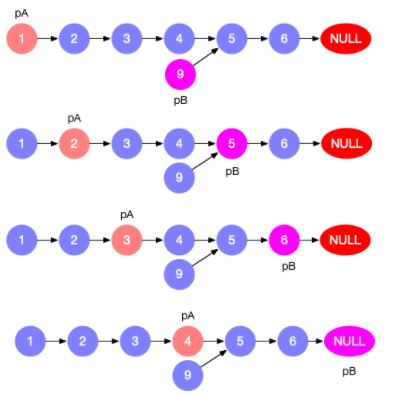
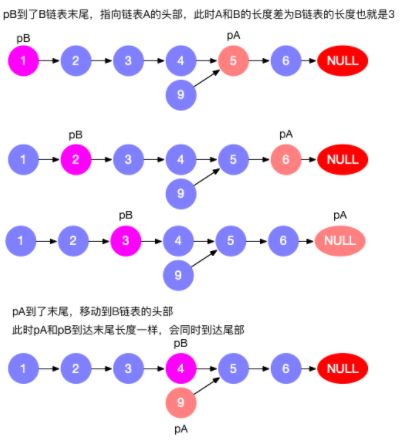
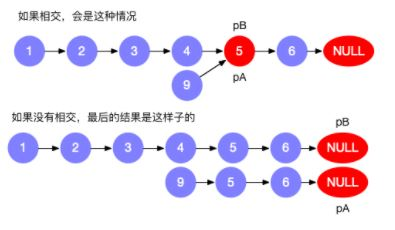

### 160.相交链表

编写一个程序，找到两个链表相交的起始节点。

**注意：**

- 如果两个链表没有交点，返回 null.
- 在返回结果后，两个链表仍须保持原有的结构。
- 可假定整个链表结构中没有循环。
- 程序尽量满足 O(n) 时间复杂度，且仅用 O(1) 内存。


**思路1：**哈希表

利用哈希表来实现 `O(1)` 的节点查询，在 Java 中可以使用 HashSet 实现。

将一个链表的所有节点存入哈希表，遍历另一个链表判断是否在哈希表中存在。

时间复杂度 `O(m+n)`，空间复杂度 `O(m)` 或者 `O(n)`

``` java
/**
 * Definition for singly-linked list.
 * public class ListNode {
 *     int val;
 *     ListNode next;
 *     ListNode(int x) {
 *         val = x;
 *         next = null;
 *     }
 * }
 */
public class Solution {
    public ListNode getIntersectionNode(ListNode headA, ListNode headB) {
        if (headA == null || headB == null) {
            return null;
        }
        Set<ListNode> set = new HashSet<>();
        for (ListNode node = headA; node != null; node = node.next) {
            set.add(node);
        }

        for (ListNode node = headB; node != null; node = node.next) {
            if (set.contains(node)) {
                return node;
            }
        }
        return null;
    }
}
```


**思路2：**双指针

初始化两个指针 `pA` 和 `pB`，分别初始化为链表 A 和 B 的头节点，并向后遍历，当到达链表尾部时，重新赋值为另一个链表的头节点。在某一刻 `pA == pB`，此时两个指针指向的节点即为相交节点。

遍历链表 `A + B` 和 `B + A` 会同时结束，如果 A，B 有相交部分的话，`pA` 和 `pB` 相等的节点就会是第一个相交的节点。

时间复杂度 `O(m+n)`，空间复杂度 `O(1)`







``` java
public class Solution {
    public ListNode getIntersectionNode(ListNode headA, ListNode headB) {
        if (headA == null || headB == null) return null;
        ListNode pA = headA, pB = headB;
        while (pA != pB) {
            pA = pA == null ? headB : pA.next;
            pB = pB == null ? headA : pB.next;
        }
        return pA;
    }
}
```

