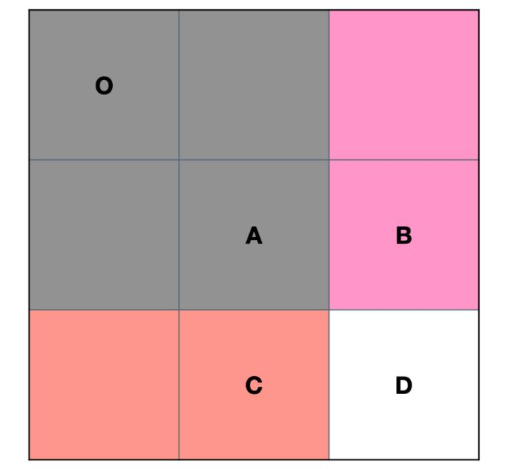
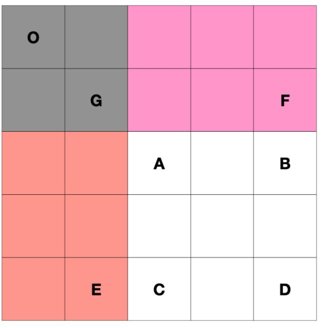

### 304.二维区域和检索-矩阵不可变

给定一个二维矩阵，计算其子矩形范围内元素的总和，该子矩阵的左上角为 `(row1, col1)` ，右下角为 `(row2, col2)` 。

``` markndown
示例：
给定 matrix = [
  [3, 0, 1, 4, 2],
  [5, 6, 3, 2, 1],
  [1, 2, 0, 1, 5],
  [4, 1, 0, 1, 7],
  [1, 0, 3, 0, 5]
]

sumRegion(2, 1, 4, 3) -> 8
sumRegion(1, 1, 2, 2) -> 11
sumRegion(1, 2, 2, 4) -> 12
```


**思路：** 二维前缀和

使用前缀和矩阵 `prefixSum` 存储矩阵的前缀和。



由上图可知，*S*(*O*,*D*)=*S*(*O*,*C*)+*S*(*O*,*B*)−*S*(*O*,*A*)+*D*

故  `prefixSum[i][j] = prefixSum[i-1][j]+prefixSum[i][j-1]+matrix[i-1][j-1] - prefixSum[i-1][j-1]`



由上图可知，S*(*A*,*D*)=*S*(*O*,*D*)−*S*(*O*,*E*)−*S*(*O*,*F*)+*S*(*O*,*G*)

故区域和公式即为 `prefixSum[row2+1][col2+1] - prefixSum[row2+1][col1] - prefixSum[row1][col2+1] + prefixSum[row1][col1]`


``` java
class NumMatrix {
    int[][] prefixSum = null;

    public NumMatrix(int[][] matrix) {
        int m = matrix.length;
        int n = matrix[0].length;
        prefixSum = new int[m+1][n+1];
        for (int i = 1; i < m; i++) {
            for (int j = 1; j < n; j++) {
                prefixSum[i][j] = prefixSum[i-1][j] + prefixSum[i][j-1] 
                    + matrix[i-1][j-1] - prefixSum[i-1][j-1];
            }
        }
    }
    
    public int sumRegion(int row1, int col1, int row2, int col2) {
        return prefixSum[row2+1][col2+1] - prefixSum[row2+1][col1]
            - prefixSum[row1][col2+1] + prefixSum[row1][col1];
    }
}

/**
 * Your NumMatrix object will be instantiated and called as such:
 * NumMatrix obj = new NumMatrix(matrix);
 * int param_1 = obj.sumRegion(row1,col1,row2,col2);
 */
```

