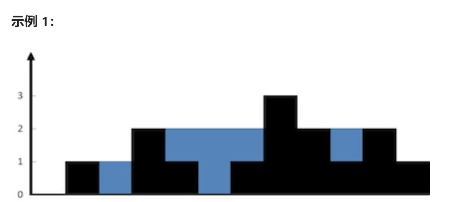

### 42.接雨水

给定 *n* 个非负整数表示每个宽度为 1 的柱子的高度图，计算按此排列的柱子，下雨之后能接多少雨水。



``` markdown
输入：height = [0,1,0,2,1,0,1,3,2,1,2,1]
输出：6
解释：上面是由数组 [0,1,0,2,1,0,1,3,2,1,2,1] 表示的高度图，在这种情况下，可以接 6 个单位的雨水（蓝色部分表示雨水）。

输入：height = [4,2,0,3,2,5]
输出：9
```

**提示：**

- `n == height.length`
- `0 <= n <= 3 * 10^4`
- `0 <= height[i] <= 10^5`


思路1：暴力

当前单元格能接到的雨水数，等于左右两侧最大高度的较小值与当前高度的差，对每个单元格遍历即可。

``` java
class Solution {
    public int trap(int[] height) {
        int water = 0;
        int size = height.length;
        for (int i = 1; i < size-1; i++) {
            int maxLeft = 0, maxRight = 0;
            for (int j = i; j >= 0; j--) {
                maxLeft = Math.max(maxLeft, height[j]);
            }
            for (int j = i; j < size; j++) {
                maxRight = Math.max(maxRight, height[j]);
            }
            water += Math.min(maxLeft, maxRight) - height[i];
        }
        return water;
    }
}
```


思路2：备忘录

提前使用数组存储当前单元格左右的最大值，最后计算。

``` java
class Solution {
    public int trap(int[] height) {
        if (height == null || height.length == 0) {
            return 0;
        }
        int size = height.length;
        int[] leftMax = new int[size];
        int[] rightMax = new int[size];
        leftMax[0] = height[0];
        for (int i = 1; i < size; i++) {
            leftMax[i] = Math.max(leftMax[i-1], height[i]);
        }
        rightMax[size-1] = height[size-1];
        for (int i = size-2; i >= 0; i--) {
            rightMax[i] = Math.max(rightMax[i+1], height[i]);
        }

        int water = 0;
        for (int i = 1; i < size-1; i++) {
            water += Math.min(leftMax[i], rightMax[i]) - height[i];
        }
        return water;
    }
}
```


思路3：双指针

首先明确变量的含义和以下定理。

``` markdown
leftMax: 当前单元格左边的最大值; left: 从左往右处理的当前下标
rightMax: 当前单元格右边的最大值; right: 从右往左处理的当前下标
```

定理一：在某个位置`i`处，它能存的水，取决于它左右两边的最大值中较小的一个。

定理二：当我们从左往右处理到 `left` 下标时，左边的最大值 `leftMax` 对它而言是可信的，但`rightMax` 对它而言是不可信的，从右往左类似。

有以下结论：

- 对于 `left` 而言，如果 `leftMax < rightMax`，那么当前高度由 `leftMax` 决定，`left` 可以递增； 
- 对于 `right` 而言，如果 `leftMax > rightMax`，那么当前高度由 `rightMax` 决定，`right` 可以递减；

``` java
class Solution {
    public int trap(int[] height) {
        if (height == null || height.length == 0) {
            return 0;
        }
        int water = 0;
        int size = height.length;
        int left = 0, right = size-1;
        int leftMax = 0, rightMax = 0;
        while (left <= right) {
            if (leftMax < rightMax) {
                water += Math.max(leftMax-height[left], 0);
                leftMax = Math.max(leftMax, height[left]);
                left++;
            } else {
                water += Math.max(rightMax-height[right], 0);
                rightMax = Math.max(rightMax, height[right]);
                right--;
            }
        }
        return water;
    }
}
```

