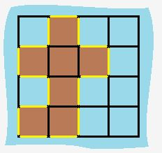

### 463.岛屿的长度

给定一个包含 `0` 和 `1` 的二维网格地图，其中 `1` 表示陆地 `0` 表示水域。

网格中的格子水平和垂直方向相连（对角线方向不相连）。整个网格被水完全包围，但其中恰好有一个岛屿（或者说，一个或多个表示陆地的格子相连组成的岛屿）。

岛屿中没有“湖”（“湖” 指水域在岛屿内部且不和岛屿周围的水相连）。格子是边长为 `1` 的正方形。网格为长方形，且宽度和高度均不超过 `100` 。计算这个岛屿的周长。

``` markdown
示例：
输入:
[[0,1,0,0],
 [1,1,1,0],
 [0,1,0,0],
 [1,1,0,0]]

输出: 16

解释: 它的周长是下面图片中的 16 个黄色的边
```




**思路**：遍历每个岛屿块的 4 条边，如果该块为边界或者附近为水域，则将该边长加入总边长。

``` java
class Solution {
    private int[][] directions = {{1,0}, {0,1}, {-1,0}, {0,-1}};
    public int islandPerimeter(int[][] grid) {
        int m = grid.length;
        int n = grid[0].length;

        int ans = 0;
        for (int i = 0; i < m; i++) {
            for (int j = 0; j < n; j++) {
                if (grid[i][j] == 1) {
                    // 检验4条边
                    for (var direction : directions) {
                        int x = i + direction[0];
                        int y = j + direction[1];
                        if (x<0 || x>=m || y<0 || y>=n || grid[x][y]==0) {
                            ans++;
                        }
                    }
                }
            }
        }
        return ans;
    }
}
```

