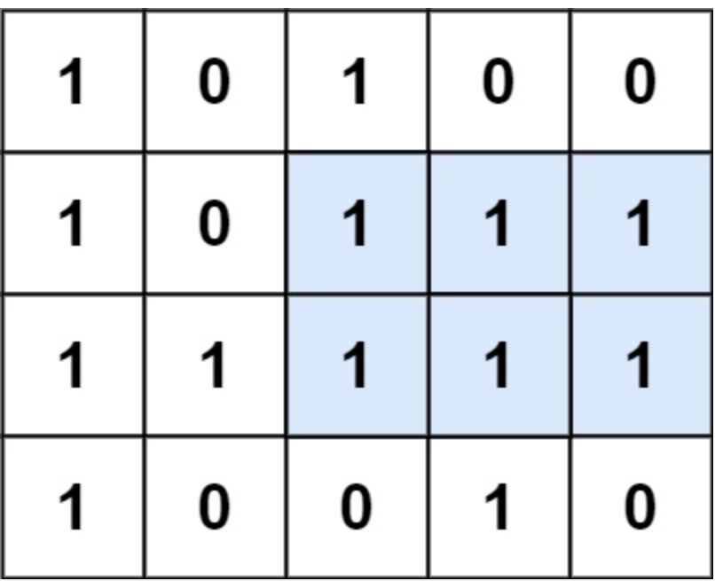

### 85.最大矩阵

给定一个仅包含 `0` 和 `1` 、大小为 `rows x cols` 的二维二进制矩阵，找出只包含 `1` 的最大矩形，并返回其面积。

 **示例1：**



``` markdown
输入：matrix = [["1","0","1","0","0"],["1","0","1","1","1"],["1","1","1","1","1"],["1","0","0","1","0"]]
输出：6
解释：最大矩形如上图所示。
```


**思路1：** 优化暴力

使用二维数组 `left[i][j]` 为矩阵第 `i` 行第 `j` 列元素的左边连续 1 的数量。

随后，对于矩阵中任意一个点，我们枚举以该点为右下角的全 11 矩形。

具体而言，当考察以 `matrix[i][j]`为右下角的矩形时，枚举满足 0 <= k <= i 的所有可能的 k，此时矩阵的最大宽度就为 `left[i][j]、left[i-1][j]、...left[k][j]` 的最小值。计算最大面积即可

``` java
class Solution {
    public int maximalRectangle(char[][] matrix) {
        if (matrix == null || matrix.length == 0) {
            return 0;
        }
        int m = matrix.length;
        int n = matrix[0].length;
        int[][] left = new int[m][n];
        for (int i = 0; i < m; i++) {
            for (int j = 0; j < n; j++) {
                if (matrix[i][j] == '1') {
                    if (j == 0) {
                        left[i][j] = 1;
                    } else {
                        left[i][j] = left[i][j-1]+1;
                    }
                }
            }
        }

        int maxArea = 0;
        for (int i = 0; i < m; i++) {
            for (int j = 0; j < n; j++) {
                if (matrix[i][j] == '1') {
                    int area = left[i][j];
                    int width = left[i][j];
                    for (int k = i-1; k >= 0; k--) {
                        width = Math.min(width, left[k][j]);
                        if (width == 0) {
                            break;
                        }
                        area = Math.max((i-k+1)*width, area);
                    }
                    maxArea = Math.max(area, maxArea);
                }
            }
        }
        return maxArea;
    }
}
```

