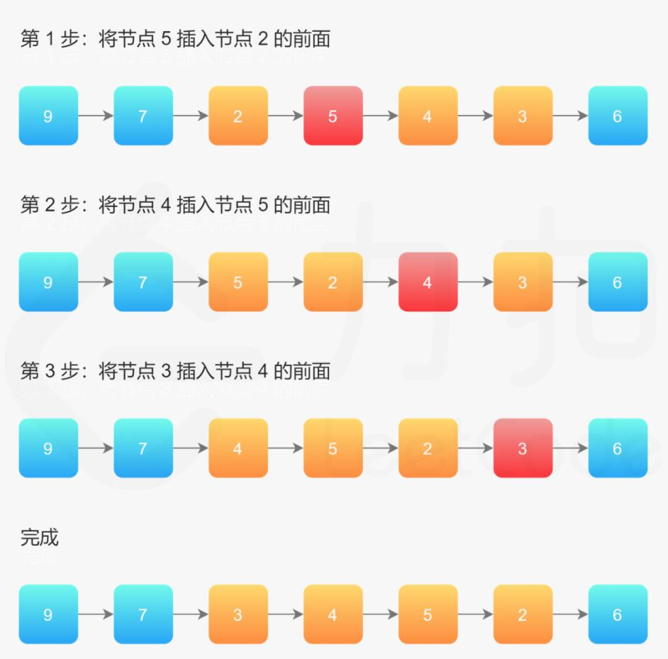

### 92.反转链表II

给你单链表的头节点 `head` 和两个整数 `left` 和 `right` ，其中 `left <= right` 。请你反转从位置 `left` 到位置 `right` 的链表节点，返回 反转后的链表 。

``` markdown
示例1:
输入：head = [1,2,3,4,5], left = 2, right = 4
输出：[1,4,3,2,5]

示例2:
输入：head = [5], left = 1, right = 1
输出：[5]
```

**提示：**

- 链表中节点数目为 `n`
- `1 <= n <= 500`
- `-500 <= Node.val <= 500`
- `1 <= left <= right <= n`


**思路：** 双指针

设置哑节点节省操作，使用 `pre`、`cur` 分别指向 `left` 的前一个节点和 `left` 节点，将 `cur` 的下一个节点插入到 `pre` 和 `cur` 之间，执行 `right-left` 次即可（操作过程中 `cur`  不变动）

 

``` java
/**
 * Definition for singly-linked list.
 * public class ListNode {
 *     int val;
 *     ListNode next;
 *     ListNode(int x) { val = x; }
 * }
 */
class Solution {
    public ListNode reverseBetween(ListNode head, int left, int right) {
        ListNode dummy = new ListNode(0);
        dummy.next = head;

        ListNode pre = dummy;
        int temp = left-1;
        while (temp-- > 0) {
            pre = pre.next;
        }

        ListNode cur = pre.next;
        int offset = right - left;
        while (offset-- > 0) {
            ListNode next = cur.next;
            cur.next = next.next;
            next.next = pre.next;
            pre.next = next;
        }   
        return dummy.next;
    }
}
```

