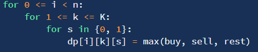
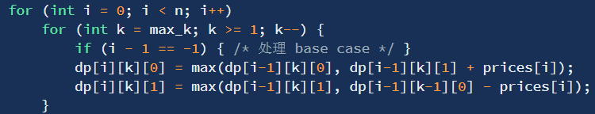

### 股票通解

买卖股票上一共有121、122、 123、 188、 309、 714 六道题，分别是不限制交易次数、交易 1 次、交易 2 次、交易 k 次、1 天冷却期、含手续费。
下面给出通解框架:

对于每一天来说，一共有 3 种选择：购买、出售、什么都不做。并满足以下要求：购买在出售之后，出售在一次购买之后。

引入本问题的三个状态：天 `i`、最多购买次数 `j` 、是否持有股票 `k`  (1 为持有，0 为卖出)

举例 `dp[3][2][1]`:现在第三天，最多能购买两次，还持有股票的状态下的受益

状态转移方程即为 `dp[i][j][k] = max(buy, sell, nodo)`，最大受益即为`dp[最后一天][最大购买次数][0]` 

下面针对不同情况分析：

①不限制次数

`dp[i][j][0] = max(dp[i-1][j][0], dp[i-1][j-1][1] + prices[i])`

`dp[i][j][1] = max(dp[i - 1][j][1], dp[i-1][j-1][0] - price[i])`

因为不限制交易次数，故可以直接去除 `j`，将内存变为O(n)

②一次

因为只有一次交易，故可以去除 `j` 

`dp[i][0] = max(dp[i-1][0], dp[i-1] + price[i])`

`dp[i][1] = max(dp[i-1][1], dp[i-1][0] - price[i])`

③冷却期，次数无限

在天数上变化

`dp[i][0] = max(dp[i-1][0], dp[i-1] + price[i])`

`dp[i][1] = max(dp[i-1][1], dp[i-2][0] - price[i])`

④手续费

购买时直接扣除手续费

`dp[i][0] = max(dp[i-1][0], dp[i-1] + price[i])`

`dp[i][1] = max(dp[i-1][1], dp[i-1][0] - price[i] - fees)`

⑤两次交易

`dp[i][j][0] = max(dp[i-1][j][0], dp[i-1][j-1][1] + prices[i])`

`dp[i][j][1] = max(dp[i - 1][j][1], dp[i-1][j-1][0] - price[i])`

⑥K次交易

注意此处K可能非常大，会爆内存，实际k的最大值为n/2 (天数的一半)

